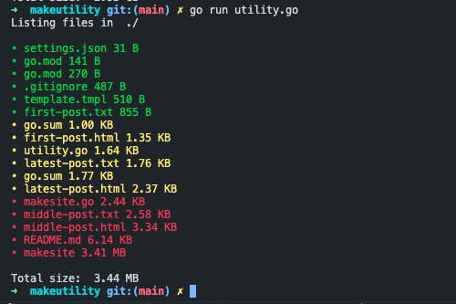

# makeutility

[](https://goreportcard.com/report/github.com/pondorasti/bew-2.5)

This is a utility script that recursively traverses the given directory and displays the files that take up the most space!

## Usage

```bash
go run utility.go <directory>
<directory>: optional, default value is current directory
```


